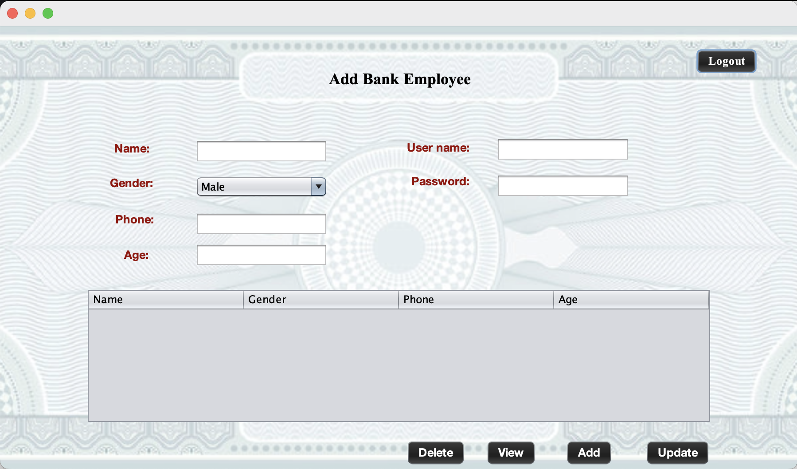

# University Management System (UMS)

## Overview
The University Management System (UMS) is a comprehensive platform designed to integrate and streamline university operations with external enterprises, including police departments, banks, and pharmacies. This Java Swing and MySQL-based application improves efficiency, reduces redundancy, and ensures seamless coordination between various entities.

---

## Problem Statement
Current university management systems are not fully integrated, resulting in inefficiencies, redundant data, and delayed decision-making. The UMS addresses these issues by centralizing core university operations and providing integration with external enterprises to enhance service delivery.

---

## Solution
UMS centralizes the management of:

### Core Operations:
- **Student Enrollment:** Simplifies registration and enrollment.
- **Course Management:** Efficient scheduling and updating of curricula.
- **Grade Tracking:** Facilitates academic performance assessment and reporting.

### External Enterprises:
- **Police:** Integration for document verification and emergency reporting.
- **Bank:** Simplifies loan processing, scholarship distribution, and fee payments.
- **Pharmacy:** Manages medicine inventory and supplier information.

### Key Features:
- **Data Security:** Ensures robust protection of sensitive data.
- **Role-Based Access:** Assigns permissions based on user roles for controlled access.
- **Automation:** Reduces manual intervention by automating routine tasks.

---

## Organization Structure

### Enterprise 1: University
- **Student Organization:** Role: Students
- **Administration Organization:** Roles: Professors, Staff

### Enterprise 2: Police
- **Crime Organization:** Role: Police Department
- **Emergency Organization:** Role: People
- **Document Organization:** Role: Employees

### Enterprise 3: Bank
- **Bank Organization:** Roles: Students, Employees

### Enterprise 4: Pharmacy
- **Pharmacy Organization:** Role: Suppliers

---

## Roles
1. Students
2. Professors
3. University Staff
4. Police Department
5. People
6. Bank Employees
7. Admin
8. Pharmacy Suppliers

---

## Screenshots

### Add Professor Interface

### Add Police Interface

### Crime Details Interface

### Documentation Interface

### Add Bank Employee Interface

### Manage Medicines Interface

### Add Student Interface

---

## Technologies Used
- **Frontend:** Java Swing for user interfaces.
- **Backend:** MySQL for data storage.
- **Programming Language:** Java

---

## How to Run the Project
1. **Prerequisites:**
   - Install JDK (Java Development Kit)
   - Install MySQL and set up the database
2. **Database Setup:**
   - Import the provided SQL script to create the necessary tables.
3. **Compile and Run:**
   - Compile the Java code using a Java IDE or the command line.
   - Run the main class to start the application.

---

## Future Enhancements
- Implement mobile-friendly versions of the application.
- Introduce advanced reporting tools using analytics.
- Expand integration with additional external enterprises.

---

For further details, refer to the uploaded screenshots for a detailed UI representation.
